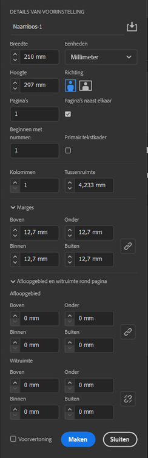

import Image from '@theme/IdealImage';

# 2.1 Basisbegrippen

Wanneer we een nieuw document opstarten in InDesign, zal je opmerken dat je heel wat instellingen te zien krijgt. Het is dan ook heel belangrijk om op voorhand zoveel mogelijk al goed te zetten hier. Zorg dus dat je voorbereid van start gaat en dat je al weet hoe groot je document moet zijn, hoe groot de *marges* moeten zijn, hoeveel *kolommen* je nodig hebt enz.

Je ziet dit telkens wanneer je een nieuw InDesign document aanmaakt.

<Image
  img={require('./img/aanmaken.png')}
  alt='Scherm dat je ziet wanneer je een nieuw InDesign document start'
/>

We kunnen hier kiezen voor een voorgemaakte optie, maar voor deze cursus doen we dat niet. We starten vanaf 0.

## De basisbegrippen

We nemen van het bovenstaande scherm de opties aan de rechterkant: `DETAILS VAN VOORINSTELLING`.

Alle basisbegrippen kunnen we hier terugvinden:

- **`Breedte`** en **`Hoogte`**: stellen het uiteindelijke <ins>paginaformaat</ins> of de <ins>bladspiegel</ins> voor.
- De **`Richting`** kies je hier om ofwel <ins>staand (= portrait view)</ins> ofwel <ins>liggend (= landscape view)</ins> te werk te gaan.
- Bij **`Pagina's`** stel je het <ins>aantal pagina's</ins> in. Wil je een spread, magazine of boek maken, dan is het aangeraden om **`Pagina's naast elkaar`** aan te zetten, je werkt dan letterlijk op een <ins>spreiding van twee pagina's</ins>.
- Bij **`Kolommen`** en **`Tussenruimte`** stel je op voorhand in hoeveel kolommen je gaat gebruiken in je document, met daarbij ook de tussenruimte tussen de kolommen. Dit zie je bij kranten en magazines, waarbij de <ins>tekst opgedeeld is in meerdere kolommen</ins>.
- De **`Marges`** zijn de <ins>witruimtes rondom de bladspiegel</ins>. Dit stellen we in zodat de tekst niet tot aan de rand van ons papier loopt. Bij een document met een plooi in het midden, zetten we de marge binnen iets groter.
- Het **`Afloopgebied`**, ofwel de <ins>bleed</ins> van ons document, is eigenlijk nog een <ins>extra witruimte</ins> rondom het document dat gebruikt wordt bij het <ins>afsnijden van een document tijdens het drukproces</ins>. Standaard zetten we dit op <ins>3 tot 5mm</ins>.
- **`Witruimte`** gaan we op zich niet gebruiken. Je moet hierbij enkel weten dat dit gebruikt wordt om <ins>bijkomende informatie</ins> (referenties, interne communicatie, …) te plaatsen. Dit wordt nooit geprint.

De afbeelding hieronder toont je een eindresultaat met daarop de termen die belangrijk zijn.

<Image
  img={require('./img/basisbegrippen.png')}
  alt='Afdrukvoorbeeld met basisbegrippen op genoteerd'
/>