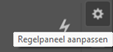
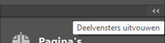
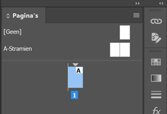

import Image from '@theme/IdealImage';

# 2.1 | De werkruimte

<Image 
  img={require('./img/werkruimte.png')}
  alt='Instellingen instellen voor het opstarten van een nieuw document.'
/>

De werkruimte bestaat uit volgende onderdelen:

1.	**Menubalk** (menu): Bovenste menubalk
2.	[**Regelpaneel**](#regelpaneel) (control panel): Instellingenbalk onder de Menubalk
3.	[**Gereedschappen**](#gereedschappen) (toolbox): De meest linkse balk met icoonjes
4.	[**Deelvensters**](#deelvensters) (panels): Het meest rechts paneel met verschillende opties
5.	**Werkgebied** (plakbord) (work area): De binnenkant van InDesign, de zogezegd bureau waar je blad op ligt
6.	**Documentvenster** (document area): Het werkblad zelf

## Gereedschappen

De gereedschappen zijn er om je snel op gang te helpen om:

- Elementen in een document te selecteren
- Elementen te gaan transformeren en aanpassen
- Elementen te gaan toevoegen zoals *Tekst*, *Afbeeldingen*, *Vormen*, ...

:::tip Cheatsheet
Bekijk de [Gereedschappen-cheatsheet](/docs/extra/gereedschappen) om te weten te komen wat elke tool doet.
:::

## Regelpaneel

Afhankelijk van welk soort element je zal aanpassen, zal het Regelpaneel er anders gaan uitzien.

##### Objecten

<Image 
  img={require('./img/regel-objecten.png')}
  alt='Regelpaneel wanneer object actief staat.'
/>

##### Tekst

<Image 
  img={require('./img/regel-tekst.png')}
  alt='Regelpaneel wanneer tekst actief staat.'
/>

#### Aanpassen

We klikken hiervoor op volgende icoontje in het regelpaneel om ons regelpaneel aan te passen.

## Deelvensters

In je deelvenster kan je alle vensters verschuiven en (de)groeperen. Je selecteert, houdt het vast, en versleept het waar je wilt. Je kan de deelvensters ook in het beeld verschuiven, zodat ze apart van de rechterbalk kunnen werken. Zoals we hiervoor al vermelde, geven wij nu een basis mee die je kan gebruiken, maar bij iedereen kan zelf kiezen hoe de werkruimte er uiteindelijk uitziet.

**Handelingen**:
-	Actief zetten van panelen: Via menubalk > Venster
-	Panelen sluiten: Rechtermuisknop > Sluiten
-	Verslepen: Muis ingedrukt houden en verslepen

Wat je ook kan doen, is via de dubbele pijl bovenaan het regelpaneel, alles uitvouwen. Dit is ook een manier om te werk te gaan.

En nog een optie is, wanneer je de icoontjes vanbuiten begint te kennen, dat je het deelvenster verkleint en op die manier werkt. Je kan ook gaan combineren en je krijgt dan iets als volgt:

