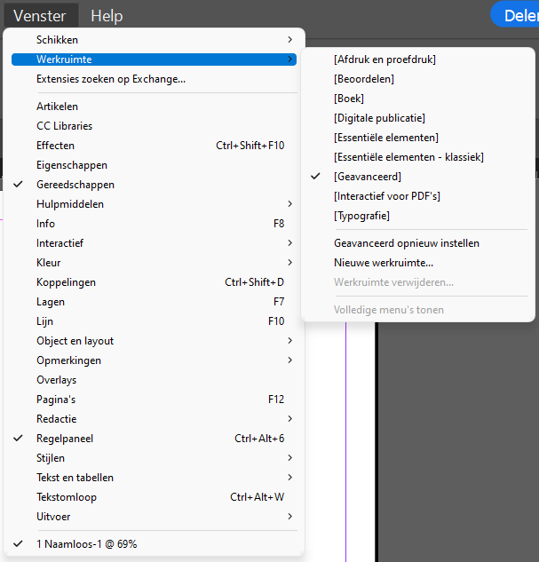
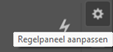
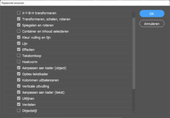
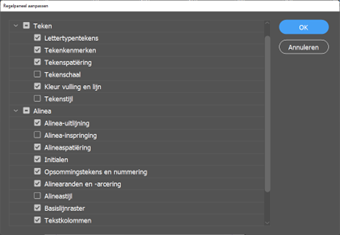
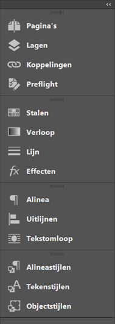

import Image from '@theme/IdealImage';

# 3.1 | InDesign personaliseren

## Intro

InDesign heeft een werkruimte die er in het algemeen bij iedereen hetzelfde uit zal zien. Zeker wanneer je InDesign voor een eerste keer opstart. Natuurlijk zijn er manieren om de werkruimte volledig naar jouw hand te zetten, zodat het voor jou een gemakkelijkere omgeving wordt. Hoe we dat doen zien we hieronder door een voorbeeld van onze eerste "klassikale" personalisatie.

Laten we beginnen bij het allereerste begin, namelijk het opstarten van InDesign.

:::info
Indien InDesign nog niet is geïnstalleerd, volg dan de stappen die je [hier](#) terugvindt..
:::

<Image
  img={require('./img/indesign-first-open.png')}
  alt='Eerste keer InDesign opstarten.'
/>

## Instellingen aanpassen

### Eenheden en toenamen

Standaard gebruikt InDesign pica's als maat. Dit is een Amerikaanse eenheid die we direct gaan aanpassen om rariteiten te vermijden.

- In het menu bovenaan klik je op **`Bewerken` > `Voorkeuren` > `Eenheden en toenamen`**.
- Bij **`Liniaaleenheden`** zet je *`Horizontaal`* en *`Verticaal`* op *`Millimeters`*.
- Klik op **`OK`**.

<Image 
  img={require('./img/Liniaaleenheden.png')}
  alt='Liniaaleenheden instellen in InDesign.'
/>

## De werkruimte inrichten

### Werkruimte resetten

Voor deze cursus stellen we dus een werkruimte samen op. Op deze manier ziet de werkruimte er hetzelfde uit bij iedereen en kunnen we elkaar goed helpen. Ook zal de werkruimte er op de afbeeldingen in de cursus er hetzelfde uitzien.

We beginnen met een standaard werkruimte te kiezen en zetten ze erna volledig naar ons hand.

-	In het menu bovenaan klik je op **`Venster` > `Werkruimte` > `[Geavanceerd]`**.
-	Klik daarna opnieuw op **`Venster` > `Werkruimte`**, maar kies nu voor **`Geavanceerd opnieuw instellen`**. Dit zorgt ervoor dat de werkruimte volledig opnieuw wordt ingesteld, zodat alles wat je voorheen eventueel aanpaste zal gereset worden.

### Werkruimte aanpassen

Laten we ter begeleiding een eerste document aanmaken. We gaan nog niet ingaan op de verschillende instellingen van het document, maar we gaan meer zien welke wijzigingen we doorvoeren wanneer we een document hebben openstaan.

Kies bij **`Snel een nieuw bestand beginnen`** voor **`A4`**. We hebben nu eigenlijk al een eerste document aangemaakt. Dat gaat vlot! Je beeld ziet eruit zoals de foto hieronder.

<Image 
  img={require('./img/werkruimte.png')}
  alt='Instellingen instellen voor het opstarten van een nieuw document.'
/>

:::tip
Voor meer informatie over hoe de werkruimte is opgebouwd, ga je naar [2.1 | De werkruimte](/docs/begrippen/2-1-werkruimte).
:::

#### Het regelpaneel

We klikken hiervoor op volgende icoontje in het regelpaneel om ons regelpaneel aan te passen.

Zonder al te veel in te gaan op wat we juist aanpassen, aangezien we al deze dingen nog gaan gebruiken, geven we een aantal screenshots over wat je moet aanpassen.

:::note
Opnieuw, en we blijven dit herhalen, dit is de manier waarop wij gaan werken in deze cursus. Het is altijd mogelijk, zelfs tijdens deze cursus, dat je je eigen omgeving aanpast. Maar zo hebben we het samen al eens kunnen doen.
:::

### Deelvensters

Je kan deelvensters aan- en uitzetten via de Menubalk bovenaan door te klikken op **`Venster`** en daar het deelvenster naar keuze aan te klikken.

We maken ons deelvenster als volgt op.

We groeperen hier verschillende bijeenhorende opties. Dit paneel kan (en zal hopelijk) veranderen naar hoe jij het zelf graag hebt.

## De werkruimte opslaan

Onze werkruimte ziet er nu (voor ons werk) wat meer overzichtelijk en gebruiksvriendelijker uit. Het is dus interessant om deze werkruimte te gaan opslaan, zodat we dit niet verliezen.

Ga naar **`Venster` > `Werkruimte` > `Nieuwe werkruimte...`**, geef een naam aan je werkruimte en laat de opties zoals ze zijn. Klik **`OK`** om de werkruimte op te slaan.

Indien je wijzigingen zou doen aan je nieuwe werkruimte, dan zullen deze automatisch opgeslagen worden. Je kan de werkruimte dan terug resetten zoals we hierboven zagen.

:::caution Let op
Een werkruimte wordt opgeslagen op een lokale gebruiker van een computer. Dit wil zeggen dat wanneer je op een andere PC de werkruimte opnieuw zal moeten instellen.
:::