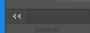

import Image from '@theme/IdealImage';

# 3.1 | InDesign personaliseren

## Intro

InDesign heeft een werkruimte die er in het algemeen bij iedereen hetzelfde uit zal zien. Zeker wanneer je InDesign voor een eerste keer opstart. Natuurlijk zijn er manieren om de werkruimte volledig naar jouw hand te zetten, zodat het voor jou een gemakkelijkere omgeving wordt. Hoe we dat doen zien we hieronder door een voorbeeld van onze eerste "klassikale" personalisatie.

Laten we beginnen bij het allereerste begin, namelijk het opstarten van InDesign.

:::info
Indien InDesign nog niet is geïnstalleerd, volg dan de stappen die je [hier](#) terugvindt..
:::

<Image
  img={require('./img/indesign-first-open.png')}
  alt='Eerste keer InDesign opstarten.'
/>

## Instellingen aanpassen

### Eenheden en toenamen

Standaard gebruikt InDesign pica's als maat. Dit is een Amerikaanse eenheid die we direct gaan aanpassen om rariteiten te vermijden.

- In het menu bovenaan klik je op **Bewerken** > **Voorkeuren** > **Eenheden en toenamen**.
- Bij **Liniaaleenheden** zet je *Horizontaal* en *Verticaal* op *Millimeters*.
- Klik op **OK**.

<Image 
  img={require('./img/Liniaaleenheden.png')}
  alt='Liniaaleenheden instellen in InDesign.'
/>

## De werkruimte inrichten

### Werkruimte resetten

Voor deze cursus stellen we dus een werkruimte samen op. Op deze manier ziet de werkruimte er hetzelfde uit bij iedereen en kunnen we elkaar goed helpen. Ook zal de werkruimte er op de afbeeldingen in de cursus er hetzelfde uitzien.

We beginnen met een standaard werkruimte te kiezen en zetten ze erna volledig naar ons hand.

-	In het menu bovenaan klik je op **Venster** > **Werkruimte** > **[Geavanceerd]**.
-	Klik daarna opnieuw op **Venster** > **Werkruimte**, maar kies nu voor **Geavanceerd opnieuw instellen**. Dit zorgt ervoor dat de werkruimte volledig opnieuw wordt ingesteld, zodat alles wat je voorheen eventueel aanpaste zal gereset worden.

<Image 
  img={require('./img/Werkruimte-instellen.png')}
  alt='Werkruimte instellen in InDesign.'
/>

### Werkruimte aanpassen

Laten we ter begeleiding een eerste document aanmaken. We gaan nog niet ingaan op de verschillende instellingen van het document, maar we gaan meer zien welke wijzigingen we doorvoeren wanneer we een document hebben openstaan.

Kies bij **Snel een nieuw bestand beginnen** voor **A4**. We hebben nu eigenlijk al een eerste document aangemaakt. Dat gaat vlot! Je beeld ziet eruit zoals de foto hieronder.

<Image 
  img={require('./img/werkruimte.png')}
  alt='Instellingen instellen voor het opstarten van een nieuw document.'
/>

Dit scherm bestaat uit volgende panelen:

1.	**Menubalk** (menu): Bovenste menu - Hoeft en kan niet aangepast worden
2.	[**Regelpaneel**](#regelpaneel) (control panel): Instellingenbalk onder de Menubalk
3.	[**Gereedschappen**](#gereedschappen) (toolbox): De meest linkse balk met icoonjes
4.	[**Deelvensters**](#deelvensters) (panels): Het meest rechts paneel met verschillende opties
5.	**Werkgebied** (plakbord) (work area): De binnenkant van InDesign, de zogezegd bureau waar je blad op ligt
6.	**Documentvenster** (document area): Het blad zelf

#### Gereedschappen

De gereedschappen zijn er om je snel op gang te helpen om:

- Elementen in een document te selecteren
- Elementen te gaan transformeren en aanpassen
- Elementen te gaan toevoegen zoals *Tekst*, *Afbeeldingen*, *Vormen*, ...

:::tip Cheatsheet
Bekijk de [Gereedschappen-cheatsheet](/docs/extra/gereedschappen) om te weten te komen wat elke tool doet.
:::

Het enige dat we hier willen / kunnen aanpassen, maar dit is zeker geen must, is de breedte. Je kan namelijk kiezen om deze balk in één kolom of twee kolommen te tonen. Dit kan je aan de hand van het dubbele pijl icoontje boven de Gereedschapsset.

#### Regelpaneel

Het Regelpaneel

#### Deelvensters

De Deelvensters