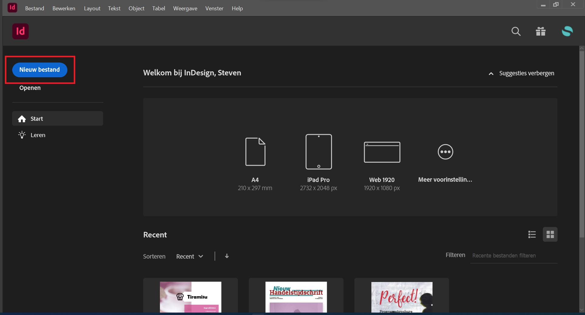
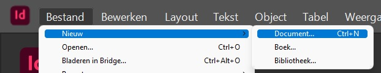

import Highlight from '@site/src/components/Highlight';

# 4.1 Een nieuw document aanmaken

Er zijn een aantal manieren om een nieuw document op te zetten. We moeten hiervoor op voorhand ook een aantal keuzes gaan maken. Willen we een document dat slechts uit één pagina bestaat? Is het een flyer met een voor- en achterzijde? Maken we een spread? Maken we een boekje, hoeveel pagina's heeft heet boekje?

Het is zeer interessant en belangrijk om op voorhand goed voorbereid te zijn om snel beslissingen te maken zonder erop te hoeven terugkeren.

:::tip Basisbegrippen
Indien je niet mee bent met de termen die gebruikt worden, kan je best de [2.1 Basisbegrippen](../begrippen-terminologie/2-1-basisbegrippen) even nakijken.
:::

## Verschillende manieren

### Welkomstscherm

De gemakkelijskte manier, is via het **Welkomstscherm** van InDesign. Dit is het eerste scherm wat je te zien krijgt wanneer je InDesign opent. Wat kan je hier nog zoals terugvinden?
- Nieuw bestand starten vanaf nul met de knop **`Nieuw bestand`**
- Nieuw bestand starten vanaf een **Suggestie**
- Een bestaand document **openen**
- Bladeren tussen je **recente** documenten

Wij maken hier gebruik van de knop **`Nieuw bestand`**, zo hebben we het meeste cotrole om ons document goed in te stellen.

### Menubalk

Een andere manier om een document op te zetten, is via de bovenste menubalk.

**`Bestand` > `Nieuw` > `Document`**

:::tip Sneltoets
Je kan op elk moment gebruik maken van de toetsencombinatie **<Highlight>Ctrl</Highlight> + <Highlight>N</Highlight>**.
:::