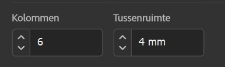
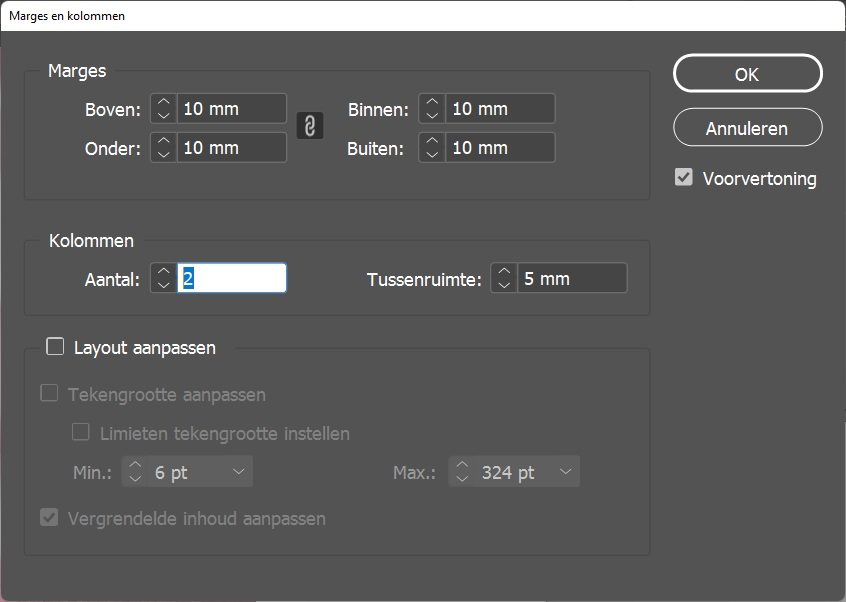

import Highlight from "@site/src/components/Highlight";

# 4.2 Kolommen en Hulplijnen

**Kolommen en hulplijnen** zijn belangrijk in InDesign omdat ze helpen bij het **organiseren en uitlijnen van inhoud op een pagina, waardoor het ontwerpproces efficiënter en nauwkeuriger wordt**.

## Kolommen

Kolommen worden gebruikt om de _lay-out van de pagina te structureren_ en het gemakkelijker te maken om _tekst en afbeeldingen op een consistente manier te plaatsen_. Door kolommen te definiëren, kan de inhoud worden uitgelijnd en verdeeld in secties, waardoor het ontwerpproces sneller verloopt. Het gebruik van kolommen kan ook helpen bij het creëren van een visueel evenwichtige pagina.

### Kolommen instellen

Voor we beginnen aan ons document, is het belangrijk om een **wireframe** te maken. Zo hebben we al ongeveer een zicht op hoe ons document er zal gaan uitzien. We weten hierdoor ook over hoeveel kolommen ons document zal bestaan.

:::tip Wireframing
Bekijk dit stuk over hoe je een wireframe maakt.
:::

Er zijn twee manieren om dit in te stellen.

- **Vanaf de start van je document**:
  - Aangezien we ons document eerst op papier maakten, hebben we een overzicht van hoeveel kolommen we wensen in te stellen. We gaan dit dat ook instellen bij het opstarten (Zie [4.1 Een nieuw document aanmaken](../indesign_basics/4-1-nieuw_document)) van ons document.
    1. Open InDesign en start een Nieuw Document.
    2. In het stuk waar je <Highlight>Kolommen</Highlight> ziet, kunt u het **aantal kolommen** selecteren dat u wilt maken, evenals de **breedte en afstand tussen de kolommen**. U kunt ook de marges van de pagina hier aanpassen als dat nodig is.
    3. Klik op <Highlight>Maken</Highlight> om je document aan te maken met het aantal gekozen kolommen.

- **Tijdens het werken aan ons document**:
  - Wanneer je toch gewoon zou starten, zonder voorbereiding (wat we <ins>niet</ins> aanraden), gaan we zelf nog de kolommen achteraf moeten instellen. Dit kunnen we doen door volgende stappen te overlopen:
    1. Open InDesign en open het document waarvoor u kolommen wilt maken.
    2. Kies het gereedschap <Highlight>Pagina</Highlight> in het gereedschappenpaneel.
    3. **Klik en sleep** over de pagina om een **kader** te tekenen waarin u kolommen wilt maken.
    4. Ga naar het <Highlight>Layout</Highlight> menu en selecteer <Highlight>Marges en kolommen</Highlight>.
    5. In het <Highlight>Marges en kolommen</Highlight> dialoogvenster kunt u het **aantal kolommen** selecteren dat u wilt maken, evenals de **breedte en afstand tussen de kolommen**. U kunt ook de marges van de pagina hier aanpassen als dat nodig is.
    6. Nadat u uw keuzes heeft gemaakt, klikt u op <Highlight>OK</Highlight> om uw kolommen in te stellen.

## Hulplijnen

Hulplijnen worden gebruikt om objecten op de pagina uit te lijnen en te positioneren. Ze kunnen worden gebruikt om de positie van tekst, afbeeldingen en andere objecten nauwkeurig te bepalen. Door hulplijnen te gebruiken, kunt u ervoor zorgen dat objecten correct zijn uitgelijnd en dat de afstand tussen objecten consistent is.

### Hulplijnen snel instellen

Hulplijnen stel je best in wanneer het document reeds gemaakt is.

- Open InDesign en open het document waarvoor u hulplijnen wilt maken.
- Kies het gereedschap <Highlight>Hulplijnen</Highlight> in het gereedschappenpaneel. Het pictogram ziet eruit als een liniaal met een pijlpunt aan de onderkant.
  - Klik op de <Highlight>liniaal</Highlight> en **sleep de hulplijn** naar de gewenste positie op de pagina. Herhaal dit proces indien nodig om extra hulplijnen toe te voegen.
  - Als u de positie van de hulplijn **nauwkeuriger** wilt instellen, kunt u dubbelklikken op de hulplijn om het <Highlight>Hulplijn</Highlight> dialoogvenster te openen. Hier kunt u de exacte positie van de hulplijn invoeren en instellen of deze van toepassing is op alle pagina's of slechts één pagina.
  - U kunt ook hulplijnen dupliceren en hergebruiken door ze te selecteren en te kopiëren <Highlight>Ctrl / Cmd + C</Highlight> en vervolgens te plakken <Highlight>Ctrl / Cmd + V</Highlight> op een andere pagina of document.
  - Je kan een **hulplijn verwijderen** door ze te selecteren en <Highlight>DEL</Highlight> te klikken.

Opmerking: U kunt ook hulplijnen maken door een object op de pagina te selecteren en te slepen terwijl u de Alt-toets ingedrukt houdt. Dit zal een hulplijn creëren op de rand van het object dat u kunt gebruiken om andere objecten uit te lijnen.

### Hulplijnen nauwkeurig instellen

De vorige opties kan je gebruiken om snel hulplijnen in te stellen welke je op die moment nodig hebt. Maar een best practice manier is om voorhand onze Hulplijnen in te stellen. Dit kan je doen van zodra je document werd aangemaakt. (Zie [4.1 Eeb-n nieuw document aanmaken](docs/04-indesign_basics/4-1-nieuw_document.mdx)).

Om hulplijnen nauwkeurig en op voorhand in te stellen ga je als volgt te werk:

- Klik op <Highlight>Layout</Highlight> in de menu bovenaan
- Kies voor <Highlight>Hulplijnen maken...</Highlight>
- Hier kan je de **rijen en kolommen instellen** afhankelijk van hoeveel je er nodig hebt. Hulplijnen kan je gebruiken om out of the box the gaan van je bestaande aantal kolommen.

Er is geen exacte studie van wat het beste is, hoe meer hulplijnen, hoe meer "vrijheid". Maar misschien is deze vrijheid niet altijd even handig. **Handig is ofwel je aantal bestaande <ins>kolommen in 2 of 3 te delen</ins> maximum en dan je <ins>hoogte te verdelen in 8 tot 12 rijen</ins>.**

:::caution Let op
Bij **Opties** kan je zien dat je de hulplijnen kan laten aanpassen aan:

- **Marges**: Hiernaar gaat onze voorkeur, de hulplijnen zullen tussen je marges gaan.
- **Pagina**: De hulplijnen worden over de hele pagina toegepast.
  :::

Een andere handige aanpak, om je hulplijnen overal toe te passen, is de hulplijnen in te stellen op je **stramien** (Zie [5.3 Stramienen](docs/05-indesign_intermediate/5-3-stramienen.mdx)).

## Samengevat

Samengevat zijn kolommen en hulplijnen belangrijk in InDesign omdat ze helpen bij het creëren van een professionele en consistent ogende lay-out, en bij het efficiënt en nauwkeurig positioneren van inhoud op een pagina.

---

:::note Bron

- Liniaalhulplijnen maken - <a href="https://helpx.adobe.com/be_nl/indesign/using/ruler-guides.html" target="_blank">Adobe</a>
  :::
