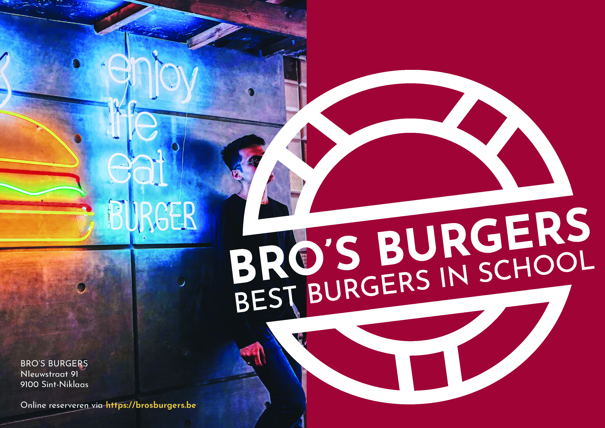

# Opdracht 2 - Menukaart

:::tip Wat leren we met deze opdracht?
- Nieuw bestand aanmaken met meerdere pagina's
- Kleuren en lettertypes toepassen en aanpassen
:::

## Introductie

Bij het tweede project gaan we al wat dieper in de mogelijkheden van InDesign. Hier leren we ook werken met stijlen om meer efficiënt te werk te gaan.

Kijk onderaan deze pagina voor het eindresultaat.

## Start

- Download de startdocumenten [hier](@site/static/opdrachten/opdracht-2.zip)
- Pak alles uit en sla op in een map op je **OneDrive**

```
📦 opdracht-2.zip
┣━ 📋 finaal_voorbeeld.pdf
┣━ 📄 menu.docx
┗━📂 assets
  ┣━📂 afbeeldingen
  ┃ ┣━📁 _logo
  ┃ ┣━ 🖼️ big_bro.jpg
  ┃ ┣━ 🖼️ brownie.jpg
  ┃ ┣━ 🖼️ chicken_tenders.jpg
  ┃ ┣━ 🖼️ enjoy_burgers.jpg
  ┃ ┣━ 🖼️ fishy_burger.jpg
  ┃ ┗━ 🖼️ waco_bro.jpg
  ┣━📁 lettertypes
  ┃ ┗━📂 JosefinSans
  ┗━📋 kleuren.pdf
```

## De opdracht

### Eerste stappen

We starten met het aanmaken van een nieuw document. Zorg voor volgende instellingen:

- [ ] **Formaat:** Drukwerk A4 <ins>liggend</ins>
- [ ] **Pagaina's:** 4
- [ ] **Kolommen:** 6 met <ins>4mm</ins> tussenruimte
- [ ] **Marges:** Overal 10mm
- [ ] Standaard afloop (weet je nog hoeveel minimum en hoeveel maximum?)

De huisstijl van het bedrijf werd voor ons gemaakt. We moeten ons hier dus aan volgen, aangezien het geheel binnen de regels moet vallen.

:::info Huisstijlen
Meer weten over **huisstijlen**? Wat ze zijn, wat erin zit, ...?<br/>
Deze bronnen zijn zeer interessant:
- Wat is een huisstijl? De 7 visuele bouwblokken van je merk - <a href="https://www.bousbous.be/blog/wat-is-een-huisstijl" target="_blank">BousBous</a>
- Wat is een huisstijl? De enige échte definitie van ‘huisstijl’ - <a href="https://abrnd.com/huisstijl/wat-is-een-huisstijl-de-enige-echte-definitie/" target="_blank">ABRND</a>
:::

Daarna voegen we wat kleuren toe aan onze **Stalen**:

- [ ] Verwijder alle bestaande kleuren uit het **`Stalen`**-paneel
- [ ] Voeg de kleuren toe die je terugvindt in de **`📂assets`** map.

We beginnen van onder naar boven, dus we voegen een achtergrond toe. We maken hiervoor een nieuwe **Laag** aan:

- [ ] Maak een <ins>nieuwe laag</ins> aan en hernoem deze naar **Achtergrond**.
- [ ] Voeg de nodige achtegronden toe door een <ins>rechthoekkader</ins> te trekken over het volledige werkblad en een kleur te geven.
- [ ] Zorg dat je de Achtergrond-laag <ins>blokkeert</ins> en selecteer de tweede laag om daarin de inhoud te gaan steken.
- [ ] Hernoem de tweede laag dan ook naar **Inhoud**.

Het logo werd ook opgemaakt in een bepaald lettertype. Om dit te kunnen gebruiken, moeten we het installeren. Gelukkig werd het ons meegeleverd in de map **`📂assets`**.

- [ ] Installeer het <ins>variabele lettertype</ins>: **Josefin Sans**.

:::info Variabele Lettertypes (Variable Fonts)
Variabele lettertypes bestaan nog niet zo lang, maar zorgen ervoor dat je maar met één installatie, alle mogelijke diktes, breedtes etc kan beheren. Lees er alles over op dit <a href="https://fonts.google.com/knowledge/introducing_type/introducing_variable_fonts" target="_blank">Google artikel</a>.
:::

:::danger Escaleren
Pas een **Verloop** toe op de voor- en achterpagina's met de kleuren `Samba Rood` en `Ontbijtrood`.
:::

### Inhoud toevoegen

:::caution Let op
Zorg dat je voor de content (= inhoud) in een **aparte laag** werkt!
:::

Bekijk voor referentie naar het voorbeeld **`📄finaal.pdf`**.

Laten we beginnen met het **logo** toe te voegen. Er zijn <ins>verschillende formaten</ins>, welke denk je dat hier het interessantste is?

- [ ] Voeg het logo in
  - [ ] Voorpagina: White
  - [ ] Center: Reverse
  - [ ] Achterpagina: Black

#### Afbeeldingen nakijken

Bij de volgende stappen gaan we verschillende inhoud invoegen, tekst maar ook afbeeldingen. Meestal zal je afbeeldingen aangeleverd krijgen van de klant, zij nemen dan de foto's zelf. Maar het kan ook zijn dat je zelf afbeeldingen zal moeten opzoeken. Dit noemen ze **stockfoto's**. Er bestaan betalende maar ook gratis stockfoto's, de betalende kan je enkel gebruiken wanneer je er een licentie voor aankoopt.

:::info Stockfoto's
Hier een aantal links naar websites met **gratis** stockfoto's.
- [Pexels](https://www.pexels.com/)
- [Pixabay](https://pixabay.com/nl/)
- [Unsplash](https://unsplash.com/)

Heb je wat geld te veel, dan kan je naar volgende **betalende services** gaan kijken.
- [Adobe Stock](https://stock.adobe.com/)
- [Shutterstock](https://www.shutterstock.com/nl/)

Je zal hoogst waarschijnlijk wel merken dat de betalende stukken mooier en relevanter zijn dan de gratis versies. Maar de gratis versies zijn zeker ook heel goed!
:::

Laten we de afbeeldingen eerst even correct zetten (Je kan [hier](../extra/9-2-omzetten) vinden hoe dat moet)
- [ ] Zet alle geleverde afbeeldingen in **300dpi** (Lees hier meer over DPI)
- [ ] Zet alle afbeeldingen om in **CMYK kleur** (Lees hier meer over kleur)

#### Voorpagina

Op de voorpagina zien we ook het adres en een afbeelding. Laten we die invoegen:

- [ ] Voeg de tekst in
  - [ ] Zet de lettertypes goed (LET OP: De link is dikker dan de andere tekst!)
  - [ ] Geef alle tekst de correcte kleuren
- [ ] Voeg een **Objectkader** in waar de foto zal komen. Dit is de helft van de voorpagina. (Let op de afloop!)

#### Achterzijde

Voeg de inhoud in op de achterzijde:

- [ ] Opmaak titels: Bold / 12pt
- [ ] Opmaak tekst: Regular / 10pt

:::danger Escaleren
Zoals je kan zien wordt er gebruik gemaakt van **Tabs**. De tekst wordt <ins>Rechts uitgelijnd op 110mm met een '.' (puntje) als Vulteken</ins>.
:::

#### Centrale spread

Als laatste vullen we de **spread** in <ins>(Een spread is de term voor 2 pagina's naast elkaar)</ins>:

- [ ] Geef alle inhoud in
  - [ ] De titels en de teksten hebben aparte **Tekstkaders**
    - [ ] **Titels**: Bold / 16pt
    - [ ] **Menu items**: Bold / 12pt
    - [ ] **Item omschrijving**: Regular / 8pt
  - [ ] Ook de **lijnen** worden achteraf apart op de pagina gezet
    - [ ] **Lijn**: 2pt / Goud
  - [ ] Side dishes?
    - [ ] **Alle tekst**: Donkere kleur en zelfde lettertype aanpassingen zoals hierboven, ook alle tekst werd onderaan uitgelijnd.
    - [ ] **Achtergrond**: Goud
    - [ ] **Tekstkader inzetafstand**: 3mm aan alle zijden
- [ ] Afbeeldingen toevoegen
  - [ ] Voeg voor je de afbeeldingen zelf invoegt de **Objectkaders** in waar nodig. (Je kan wanneer je een **Objectkader** invoegt de pijltjestoetsen gebruiken om een **Objectraster** te maken waar je afbeeldingen dezelfde grootte verkrijgen)
  - [ ] Maak een **Objectraster**
  - [ ] Voeg de afbeeldingen in de rasters in

### Afwerking

We zijn zo goed als klaar, wat we nu nog moeten doen is alles bundelen en zorgen dat we het naar de drukker kunnen sturen. De verschillende mogelijkheden kan je hier vinden.

- [ ] Exporteer het document als PDF met enkele pagina's en alle afdruktekens zichtbaar en noem dit: **`menu-[naam]_[voornaam].pdf`**
- [ ] Exporteer het document als PDF in spreads zonder afdruktekens en afloop en noem dit: **`menu-spread-[naam]_[voornaam].pdf`**
- [ ] Exporteer alles als een pakket en noem het **`menu-pakket-[naam]_[voornaam]`**

Voila, we hebben een menu vanaf nul gemaakt en hebben het klaargemaakt om op te sturen naar de drukker.

:::caution Indienen
Indien je deel uitmaakt van de fysieke cursus, kan het zijn dat we vragen om dit te uploaden op Teams. Wanneer dit moet zal je het volledige pakket inclusief de afgewerkte PDF's in een **gecomprimeerde map** moeten steken om te uploaden.

Je vindt [hier](../extra/9-4-comprimeren) terug hoe je een gecomprimeerde map aanmaakt.
:::



