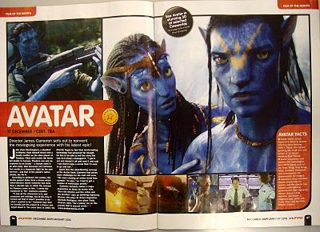
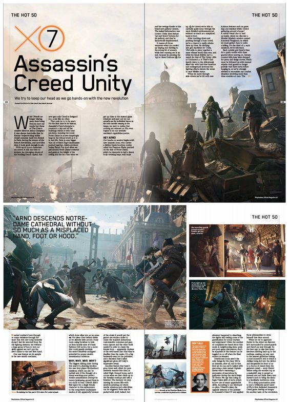

import Highlight from '@site/src/components/Highlight';

# Opdracht 3 - Review magazine

## 2022 in review

We maken samen met de hele klas één magazine genaamd <Highlight>2022 in Review</Highlight>.

De opdracht is simpel: **Maak een spread (= dubbele pagina) voor een recensie van een <ins>film, serie of game</ins> naar keuze, gemaakt in 2022**. Je kiest dus zelf het onderwerp. We bundelen alle werkjes samen en maken er één magazine van.

Voor de tekst mag je gebruik maken van [ChatGPT](https://chat.openai.com/). Indien je zelf geen account hebt of wil maken, mag je het vragen aan de leerkracht om het voor jou te doen.

Maak creatief gebruik van foto's, zet tekst in kolommen, zet een quote overtuigend op het blad, ... Kortom, maak er iets leuks van.

Hieronder vind je een aantal voorbeelden.

:::caution Indienen
Je dient deze opdracht in op het einde van de les in een **Pakket**.
:::