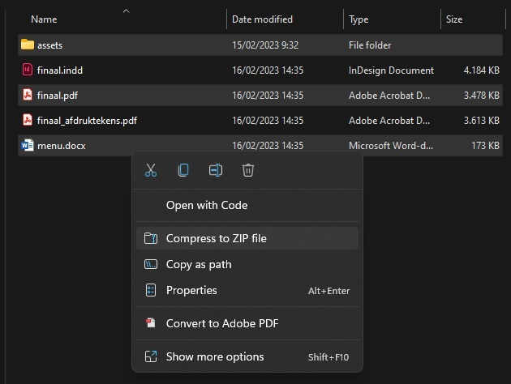
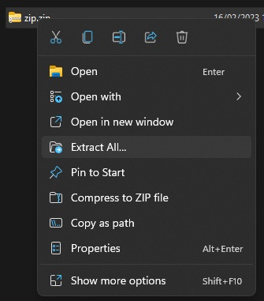

import Highlight from '@site/src/components/Highlight';

# Een bestand comprimeren

In vele gevallen zal je niet zomaar een bestand kunnen doorsturen. Ofwel kan je niet gewoon een "map 📁" uploaden of doorsturen ofwel moet je alles apart doorsturen. Dat is heel veel en onnodig werk.

Hiervoor hebben we een gecomprimeerde of **gezipte** map voor. Je maakt als het ware een pakketje van alle bestanden die je in een keer wil doorsturen naar een klant. (Wij doen dit btw ook in deze cursus om jullie de nodige bestanden aan te leveren)

We zien hieronder hoe we een gezipte map aanmaken en hoe we ze kunnen openen.

## Een gecomprimeerde map aanmaken

- We selecteren de bestanden welke we willen bundelen (zie hieronder voor tips).
- Rechtermuisknop en kies voor kopiëren naar gecomprimeerde map
- Geef een naam aan de map en klaar!

Dit bestand `naam-van-het-bestand.zip` kan je nu in zijn geheeld doorsturen of uploaden waar nodig.

:::tip Sneltoetsen in de verkenner
Hieronder sommen we een aantal sneltoetsen op die je kan gebruiken bij het werken in je verkenner.
- <Highlight>CTRL</Highlight> + <Highlight>A</Highlight>: Alles selecteren
- <Highlight>SHIFT</Highlight>: Selecteer een item in je verkenner, houdt de <Highlight>SHIFT</Highlight>-toets ingedrukt, klik op een volgende item in dezelfde map om alle items te selecteren van dat ene item tot het laatste item.
- <Highlight>CTRL</Highlight>: Door de <Highlight>CTRL</Highlight>-toets ingedrukt te houden kan je verschillende items in een map selecteren.

Je kan ook verschillende toetsen combineren.
:::

## Een gecomprimeerde map uitpakken

We noemen het openen van zo'n bundel of pakket, het **uitpakken van een gezipte map**. Dit is heel simpel.

- Plaats de gezipte map waar je ze wil uitpakken
- Klik met je Rechtermuisknop op de gezipte map en kies voor: **Alles uitpakken**.
- Je krijgt nog een scherm waar je op **OK** klikt en klaar.

:::tip ZIP Programma's
De gebruikservaring van het comprimeren en uitpakken in Windows laat soms wat van zich afweten. Er bestaan dus heel veel andere tools om met gezipte bestanden te werken welke soms beter en sneller werken. Hier een lijstje van een aantal gekende:
- [WinRAR](https://www.winrar.be/nl/download)
- [7-zip](https://www.7-zip.org/)
- [WinZip](https://www.winzip.com/nl/)

Welke je gebruikt maakt niet zoveel uit, ze doen veelal hetzelfde. Je kan zelfs gewoon bij de standaard ZIP van Windows blijven.
:::