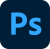
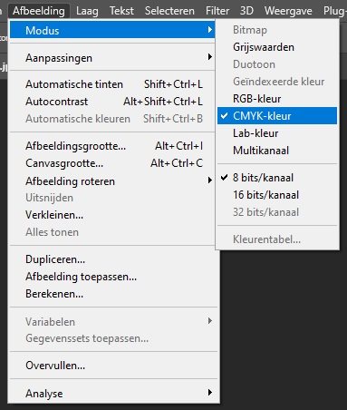
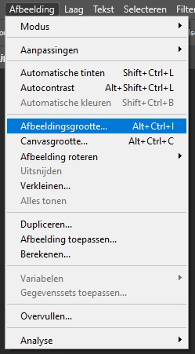
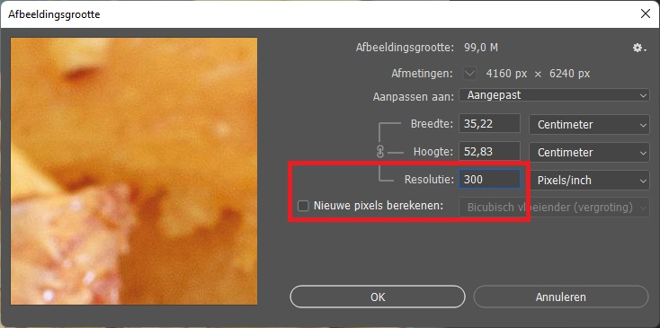
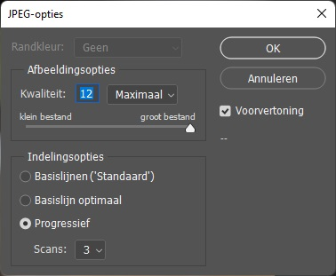

# Hoe maak ik een afbeelding drukklaar

:::caution Let op!
Voor volgende handelingen moet je beschikken over Adobe Photoshop of een dergelijke programma.  

:::

Een afbeelding dat gebruikt zal worden voor druk, zal ook **drukklaar** gemaakt moeten worden. Dit wil vooral zeggen dat de afbeelding in een bepaald formaat opgeslagen wordt.

Meestal moet je ervoor zorgen dat je afbeelding in CMYK-modus staat (zie kleuren) en een dpi heeft van 300 (zie dpi-sectie).

Er zijn tal van mogelijkheden om dit in orde te brengen. De gemakkelijkste manier is om dit zo aangeleverd te krijgen. Maar in de realiteit is dat niet altijd zo. We moeten dit dus zelf gaan aanpassen. We gebruiken, in ons geval, hiervoor **Adobe Photoshop**.

- Open `Adobe Photoshop`.
- Open de afbeelding welke je drukklaar wenst te zetten.
- Je doet daarna volgende handelingen:
  - Klik in de bovenste menubalk op **`Afbeelding` > `Modus` > `CMYK-kleur`** 
   
  Hiermee stellen we de kleurmodus in als CMYK. Klik op `OK` en de afbeelding zal zich aanpassen.
  - Daarna klik je op **`Afbeelding` > `Afbeeldingsgrootte`** 
   
  - Hier pas je de resolutie aan naar **300** en zorg je ervoor dat je het vinkje **Nieuwe pixels berekenen** <ins>uitzet</ins> 
  
  - Klik op `OK` en sla de afbeelding op. Zorg ervoor dat je voor een maximale kwaliteit kiest. 
  