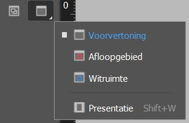

import Image from '@theme/IdealImage';
import Highlight from '@site/src/components/Highlight';

# Gereedschappen

## Cheatsheet

<Image 
  img={require('./img/toolset-cheatsheet.jpg')}
  alt='Cheatsheet van de gereedschapsset in InDesign.'
/>

## Toevoegingen

### Schermweergave

U kunt de zichtbaarheid van het documentvenster wijzigen met de modusknoppen onder in de gereedschapsset of met de opdrachten in het menu **Weergave** > **Schermmodus**. Wanneer de gereedschapsset als één kolom wordt weergegeven, kunt u de weergavemodi selecteren door op de knop voor de huidige modus te klikken en een andere modus te kiezen in het menu dat verschijnt.

Om snel te wisselen van modi (tussen **normaal** en **voorvertoning**), gebruik je de sneltoets <Highlight>W</Highlight>

| Modus                 | Icoon                                                 | Uitvoer                          | Niet-afdrukbare elementen (*) | Extra                                                            |
| :-------------------- | ----------------------------------------------------- | -------                          | ----------------------------- | ---------------------------------------------------------------- |
| Normaal               |               | Standaard (blad waarop je werkt) | Zichtbaar                     | /                                                                |
| Voorvertoning         |  | Uiteindelijke uitvoer (druk)     | Niet zichtbaar                |                                                                  |
| Afloopgebied          |    | Uiteindelijke uitvoer (druk)     | Niet zichtbaar                | Afdrukbare elementen in het afloopgebied worden weergegeven      |
| Witruimte rond pagina |          | Uiteindelijke uitvoer (druk)     | Niet zichtbaar                | Alle afdrukbare elementen rondom het document worden weergegeven |
| Presentatiemodus      |       | Diavoorstelling                  | Niet zichtbaar                | Geen menu's, deelvensters of gereedschappen                      |

(*) Niet afdrukbare elementen: rasters, hulplijnen, niet-afdrukbare objecten

#### Presentatiemodus 

Meer informatie over de Presentatiemodus op de [website van Adobe](https://helpx.adobe.com/be_nl/indesign/using/dynamic-pdf-documents.html#use_presentation_mode).

---

:::note Bronnen
- Adobe InDesign CS6 & CC Shortcut Sheet - <a href='https://www.bringyourownlaptop.co.nz/posts/indesign-shortcuts-that-will-change-your-life.html' target='_blank'>Bring Your Own Laptop</a>
- Basisbeginselen van de werkruimte - <a href='https://helpx.adobe.com/be_nl/indesign/using/workspace-basics.html' target='_blank'>Adobe</a>
:::